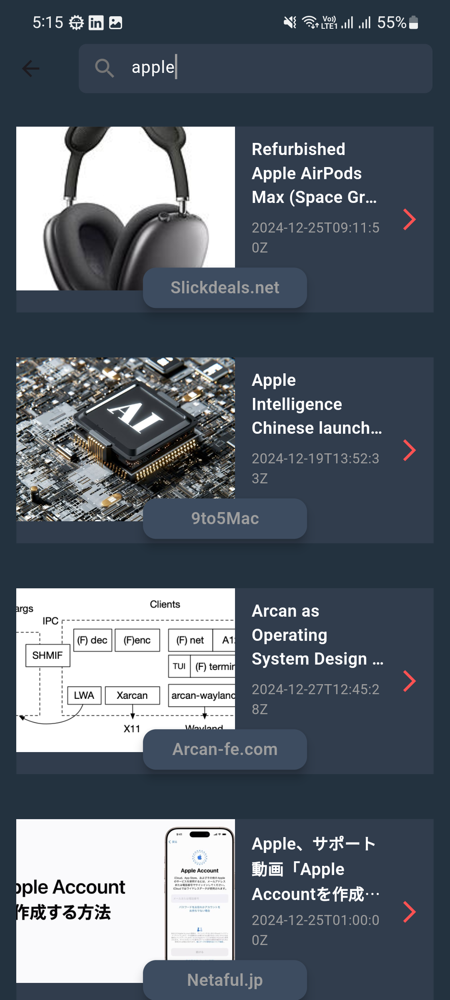

📱 News App
    News App is a Flutter application that provides users with up-to-date news from around the world. The app is built using Flutter and integrates modern features for an excellent user experience.

🚀 Features
    🌍 Browse the latest news by categories (e.g., Health, Sports, Business).
    🔎 Search functionality to find news articles.
    📖 Open full articles within an in-app browser.
    🔄 Pull-to-refresh to get the latest updates.
🛠️ Technologies Used
    Flutter: For building the cross-platform application.
    WebView: To display news articles within the app.
    REST API: Fetch news articles from a third-party news API.

🌐 APIs Used
    NewsAPI

📸 Screenshots
    
    

👤 Author
    Name: Mohamed Fayez
    Email: Mohfayez2412@gmail.com
    GitHub: https://github.com/MohamedFayez20

